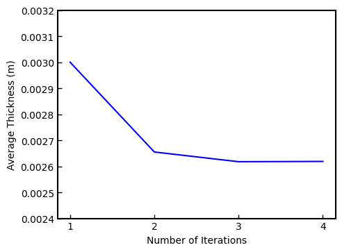
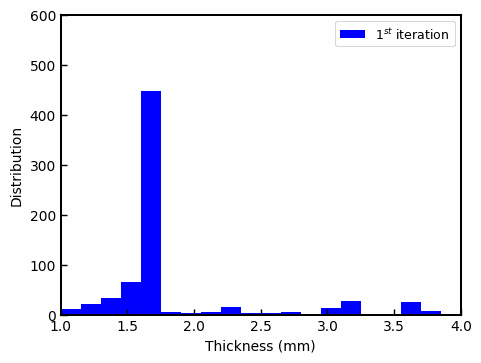

# Optimization of Parison Thickness with ANSYS Polyflow

Blow molding is one of the most widely used method to produce hollow plastic products. In a basic process, a tube-like melt plastic called parison is clamped into a mold and then pressurized air is blown into the parison so that the parison is pushed out to match the mold. In blow molding process, parison thickness programming is the main step that determines all thickness distribution of the product. Almost for every product, parison thickness must be adjusted so that the wall thickness of the products meets the customer’s demand. So, the parison thickness is generally programmed by process managers considering the wall thickness distribution of the product. Parison thickness programming is also important for reducing the weight of the flash material remained when the product is separated. Reducing the weight of the flash material is very favorable because, they cannot be recycled and used forever due to its limited processability. Also, regaining flash materials in the grinder machines are very energy intensive and in this manner, reduced flash material prevents the excess energy consumption.

A simple bottle model was simulated using the Polyflow, Ansys. The result of the Polyflow simulation is shown in figure 1. As seen, in the simulation no parison programming is done and before air is blown into it, the wall thickness is 3 mm everywhere in the parison. At the end of the simulation, wall thickness throughout the bottle varied and the flash material below the bottle remained thicker which caused a waste of raw material.

    <b>Figure 1</b> Blow Molding Simulation without Parison Programming

In order to achieve a uniform wall thickness around 1.5 mm and prevent the waste of raw material for flash material. Parison thickness was optimized with parison programming in Polyflow. As can be seen in figure 2a, in each simulation with parison programming, average thickness was reduced and a more uniform thickness distribution is achieved at the end of fourth iteration. Moreover, whereas figure 2b shows that in the first simulation, wall thickness of the product was distributed around 1.7 mm, after the fourth simulation the thickness of 1.5 mm is achieved as desired.

    <b>Figure 2</b> a) Average thickness for each iteration    b) Thickess distribution

The final simulation can be seen in figure 3.  After four simulations were carried out, the thickness was distributed more uniformly and **raw material usage is decreased by 12.7%.**

    <b>Figure 3</b> Blow Molding Simulation with Parison Programming

ANSYS Polyflow blow molding simulation results are evaluated in `Polyflow_Simulation_Results.ipynb`.

## References
<a id="1">[1]</a> 
Pepliński, K., & Bieliński, M. (2009). Polyflow Software Use To Optimize The Parison Thickness In Blowing Extrusion. Journal of Polish CIMAC, 4, 99-103.
  
