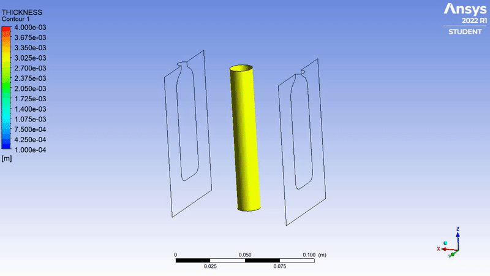

# Optimization of Parison Thickness with ANSYS Polyflow
Blow molding is one of the most widely used method to produce hollow plastic products. In a basic process, a tube-like melt plastic called parison is clamped into a mold and then pressurized air is blown into the parison so that the parison is pushed out to match the mold. In blow molding process, parison thickness programming is the main step that determines all thickness distribution of the product. Almost for every product, parison thickness must be adjusted so that the wall thickness of the products meets the customer’s demand [[1]](#1).

    <b>Figure 1</b> Blow Molding Simulation without Parison Programming

## References
<a id="1">[1]</a> 
Noor U Din Reshi, Masood Ahmad Rizvi, Syed Kazim Moosvi, Mudasir Ahmad, Adil Gani,
Chapter 16 - Solubility of organic compounds in scCO2,
Editor(s):  Inamuddin, Abdullah M. Asiri, Arun M. Isloor,
Green Sustainable Process for Chemical and Environmental Engineering and Science,
Elsevier,
2020,
Pages 379-411,
ISBN 9780128173886,
https://doi.org/10.1016/B978-0-12-817388-6.00016-7.
(https://www.sciencedirect.com/science/article/pii/B9780128173886000167)
  
